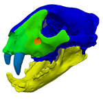

<a name="readme-top"></a>


<!-- PROJECT SHIELDS -->
[![LGPLv3 licence][license-shield]][license-url]


<!-- PROJECT LOGO -->
<br />
<div align="center">
  <a href="https://github.com/cvergari/mesh_regionalization">
    
  </a>

<h3 align="center">mesh regionalizer</h3>

  <p align="center">
    A simple graphic interface to define regions in a 3D mesh.
    <br />
    <a href="https://github.com/cvergari/mesh_regionalization"><strong>Explore the docs »</strong></a>
    <br />
    <br />
    <a href="https://github.com/cvergari/mesh_regionalization/issues">Report Bug</a>
    ·
    <a href="https://github.com/cvergari/mesh_regionalization/issues">Request Feature</a>
  </p>
</div>


<!-- TABLE OF CONTENTS -->
<details>
  <summary>Table of Contents</summary>
  <ol>
    <li>
      <a href="#about-the-project">About The Project</a>
      <ul>
        <li><a href="#built-with">Built With</a></li>
      </ul>
    </li>
    <li>
      <a href="#getting-started">Getting Started</a>
      <ul>
        <li><a href="#prerequisites">Prerequisites</a></li>
        <li><a href="#installation-with-anaconda">Installation with anaconda</a></li>
      </ul>
    </li>
    <li><a href="#usage">Usage</a></li>
    <li><a href="#contributing">Contributing</a></li>
    <li><a href="#license">License</a></li>
    <li><a href="#contact">Contact</a></li>
    <li><a href="#acknowledgments">Acknowledgments</a></li>
  </ol>
</details>


<!-- ABOUT THE PROJECT -->
## About The Project

| [![Product Name Screen Shot][product-screenshot]](https://example.com) |
|:--:|
| <i>3D model Credits : Lobo et al., 2013. MorphoMuseuM 7:156. [DOI:10.18563/m3.sf.843](https://doi.org/10.18563/m3.sf.843)</i>|


This **very basic** program is a tool to define regions in a 3D model, by painting them like a brush. The number and names of the regions is easily customizable, and the results can be exported in a text file.

<p align="right">(<a href="#readme-top">back to top</a>)</p>


## Disclaimer

This program is in a very early stage of development. Don't expect too much of it...and <a href="#contributing">contribute</a> if you are interested!


### Built With

* [![Pyvista][Pyvista.gif]][Pyvista-url]
* [![Pyside][Pyside.gif]][Pyside-url]

<p align="right">(<a href="#readme-top">back to top</a>)</p>


<!-- GETTING STARTED -->
## Getting Started

This is an example of how you may give instructions on setting up your project locally.
To get a local copy up and running follow these simple example steps.

### Prerequisites

First, clone the repository:
   ```sh
   git clone https://github.com/cvergari/mesh_regionalization.git
   ```

### Installation With Anaconda

1. Create a conda environment using the provided env.yml file
  ```sh
conda env create -f env.yml
conda activate pyvista
  ```
This will automatically install the prerequisites, which are:
  - python
  - numpy
  - pyside2
  - pyvista
  - pyvistaqt

If you don't use anaconda, you can install all these packages with pip. I strongly recommend installing them in a virtual environment.

1. Configure the regions you want to use in the file src/config.py:

  ```python
REGIONS = ['Region 1', 'Region 2', 'Region 3', 'Region 4', 'Region 5', 'Region 6']
  ```
3. Run the GUI with
  ```sh
python main.py
  ```

<p align="right">(<a href="#readme-top">back to top</a>)</p>


<!-- USAGE EXAMPLES -->
## Usage

First, open a mesh (only .stl files are supported for now). The mouse works like a brush, coloring in red the region below it. You can adjust the size of the brush with the slider.
Select one of the regions with the toggle button, which will become green. Hover over the region you want to paint and press `SHIFT`. As long as you keep `SHIFT` pressed, you will continue painting. No need to click. If you want to remove cells from the current region, press `CTRL` and paint the cells you want to remove.

### Saving

You can save the data for further usage. The save file can also be re-opened in mesh_regionalization.
The save file has a .3D extension, but it is actually a zip file. You can rename it as .zip and explore its contents.
The save file contains the following files:

* `mesh.stl`:  the original mesh.
* `region_data.dict`: a text file containing a python dictionary, with a list of the regions and their associated unique values.
* `regions.array`: a text file containing an array which associates each cell to a given region, through its unique value.

<p align="right">(<a href="#readme-top">back to top</a>)</p>


<!-- CONTRIBUTING -->
## Contributing

Contributions are what make the open source community such an amazing place to learn, inspire, and create. Any contributions you make are **greatly appreciated**.

If you have a suggestion that would make this better, please fork the repo and create a pull request. You can also simply open an issue with the tag "enhancement".
Don't forget to give the project a star! Thanks again!

1. Fork the Project
2. Create your Feature Branch (`git checkout -b feature/AmazingFeature`)
3. Commit your Changes (`git commit -m 'Add some AmazingFeature'`)
4. Push to the Branch (`git push origin feature/AmazingFeature`)
5. Open a Pull Request

<p align="right">(<a href="#readme-top">back to top</a>)</p>

## TODO

* A lot
* Add support for other mesh files (very easy: pyvista already supports .ply and others. Just need to modify the "open" menu filters, and the file type checks)
* Change the way regions are stored. Now they are stored directly as mesh's cell [scalars](https://docs.pyvista.org/user-guide/data_model.html#cell-data). However, this makes it difficult to color cells when the mouse is hovering over an already selected region.
* Improve documentation and comments

<!-- LICENSE -->
## License

Distributed under the GPLv2 License. See `LICENSE.txt` for more information.

<p align="right">(<a href="#readme-top">back to top</a>)</p>


<!-- CONTACT -->
## Contact

Claudio - [@clavergari](https://twitter.com/clavergari)

Project Link: [https://github.com/cvergari/mesh_regionalization](https://github.com/cvergari/mesh_regionalization)

<p align="right">(<a href="#readme-top">back to top</a>)</p>


<!-- ACKNOWLEDGMENTS -->
## Acknowledgments

* [Best-README-Template](https://github.com/othneildrew/Best-README-Template)

<p align="right">(<a href="#readme-top">back to top</a>)</p>


<!-- MARKDOWN LINKS & IMAGES -->
<!-- https://www.markdownguide.org/basic-syntax/#reference-style-links -->
[contributors-shield]: https://img.shields.io/github/contributors/cvergari/mesh_regionalization.svg?style=for-the-badge
[contributors-url]: https://github.com/cvergari/mesh_regionalization/graphs/contributors
[forks-shield]: https://img.shields.io/github/forks/cvergari/mesh_regionalization.svg?style=for-the-badge
[forks-url]: https://github.com/cvergari/mesh_regionalization/network/members
[stars-shield]: https://img.shields.io/github/stars/cvergari/mesh_regionalization.svg?style=for-the-badge
[stars-url]: https://github.com/cvergari/mesh_regionalization/stargazers
[issues-shield]: https://img.shields.io/github/issues/cvergari/mesh_regionalization.svg?style=for-the-badge
[issues-url]: https://github.com/cvergari/mesh_regionalization/issues
[license-shield]: https://img.shields.io/github/license/cvergari/mesh_regionalization.svg?style=for-the-badge
[license-url]: https://github.com/cvergari/mesh_regionalization/blob/master/LICENSE
[linkedin-shield]: https://img.shields.io/badge/-LinkedIn-black.svg?style=for-the-badge&logo=linkedin&colorB=555
[linkedin-url]: https://linkedin.com/in/cvergari
[product-screenshot]: ./images/screenshot.png


[Pyvista.gif]: ./images/pyvista.gif
[Pyvista-url]: https://www.pyvista.org/

[Pyside.gif]: ./images/pyside.gif
[Pyside-url]: https://github.com/pyside/pyside-setup
